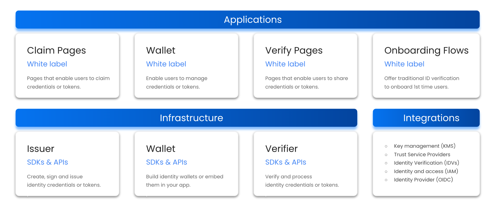

# Implementation

## Overview

walt.id will provide a number of open source software components under a permissive licence (Apache 2) to be used in the course of this pilot.

## Infrastructure Solutions

The following libraries, SDKs and APIs will be provided

- The Issuer which provides all functionality required by organizations to digitize identity documents and issue digital identity documents to stakeholders.
- The Wallet which enables organizations to offer identity wallets to their stakeholders (citizens, organizations) so that they can collect, manage and share their identity information.
- The Verifier which provides all functionality required by organizations to verify digital identity documents from stakeholders.

## Applications

The following white label applications will be provided:

- Claim pages which enable citizens and organizations to claim digital identity documents (e.g. via eGovernment portals).
- Wallets (progressive web apps; mobile apps) which enable citizens and organizations to collect, manage and share their digital identity documents.
- Verify pages which enable organizations to verify digital identity documents from citizens and other organizations (e.g. via eGovernment portals) for use cases like authentication, identity verification, user onboarding, check-out, etc.
- Onboarding Flows which enable individuals or organizations to go through traditional identity verification processes and claim digital identity wallets filled with relevant identity credentials (e.g. core identity, KYC data)

## Integrations

The following set of integrations to ensure that our solutions can be seamlessly integrated with existing IT infrastructure and applications. Integrations include key management services (KMS), digital signature services, identity and access management (IAM) solutions (e.g. KeyCloak). Identity verification (IDV) services as well as an identity provider (OpenID Connect).

## Architecture

The following graphic illustrates the high-level architecture of the implementation as provided for the project:

_Note that non-custodial applications (wallets, verifiers) are not part of the required solutions and are, therefore, no required deliverables._

## Excursus: Alignment with eIDAs2

Note the project and its architecture will be continuously aligned with progress of the eIDAS2 regulations and respective technical documents (particularly the Architecture Reference Framework, ARF). Alignment already becomes clear when comparing the architecture (outlined above) with the eIDAS2 ARF documentation from today (e.g. support for W3C VCs, ISO mDL, IETF SD-JWTs, OID4VC, …)

## Excursus: Data Storage

Data from identity verifications must typically be stored for a certain period of time to allow for legal auditing by public authorities. Concrete legal obligations vary from one (European) country to another. As a result, there are two options for managing data storage in this pilot (and beyond):

1. Storage via a third party: KYC data can be stored by a third party offering specialised service, such as identity verification companies (IDVs) or qualified trust service providers (QTSPs) who are certified and experienced with complying with the relevant regulatory requirements for data storage.
2. Storage by the Verifier: KYC data can also be stored by the Verifier, if the Verifier can comply with legal obligations for data storage expressed by relevant regulations. Even if data is being stored by a specialised service provider (see above), the Verifier can still store data as required to provide services (aligned with GDPR data minimization requirements), while pushing the obligation for regulatory compliance to the specialised service provider.
