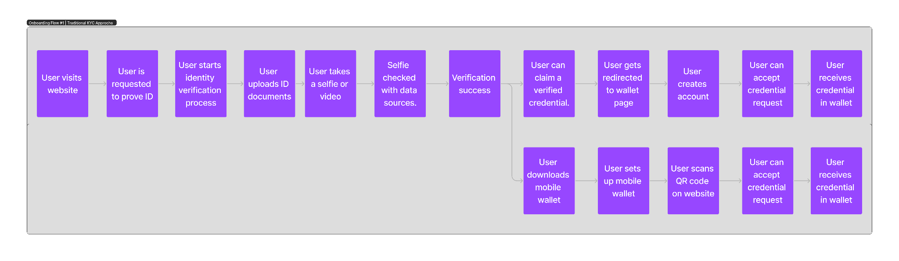
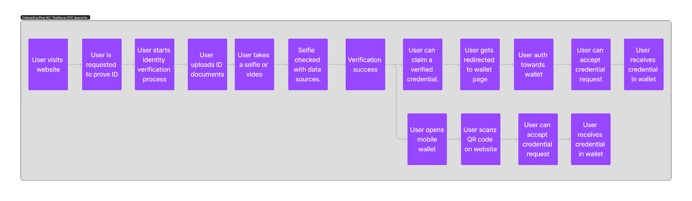
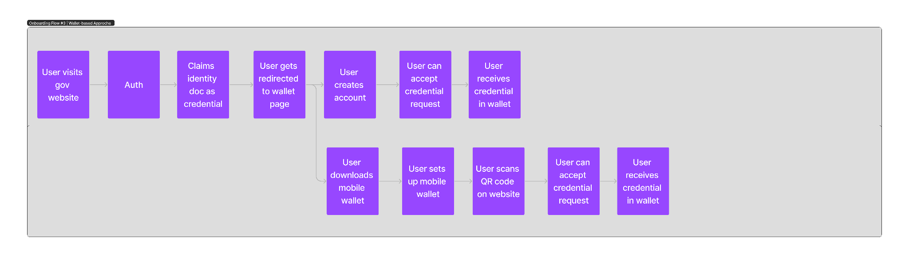
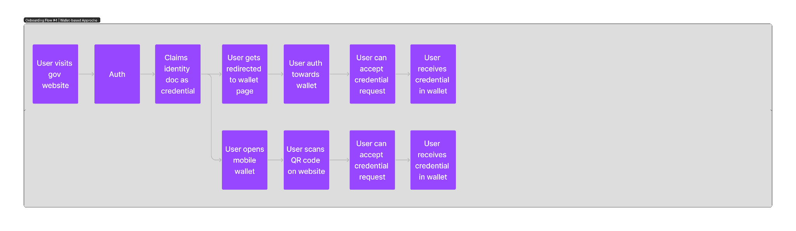
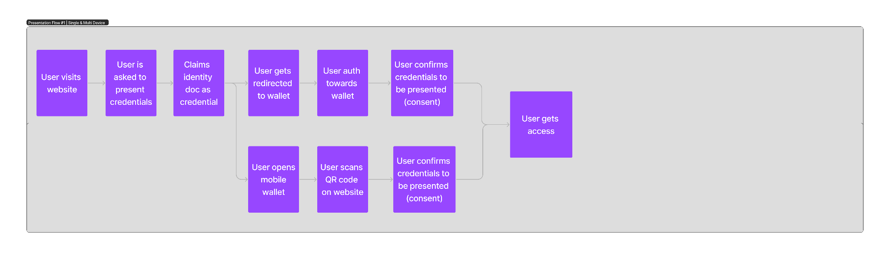

# User Journeys

This section provides a functional overview over the proposed project implementation and KYC flows from
a user perspective. Different scenarios are addressed based on the elaborations outlined in other sections
of this document.

## CTraditional KYC Approach

Context for this flow: User does not have a wallet, goes through the traditional KYC process, creates a wallet and claims credentials.

## Traditional KYC Approach

Context for this flow: User does have a wallet, goes through the traditional KYC process and claims credentials.

## Wallet-based Approach

Context for this flow: User does not have a wallet, visits the government website, creates an (EUDI) wallet and claims credentials.

## Wallet-based Approach

Context for this flow: User does have a (EUDI) wallet, visits government website and claims credentials.

## Single-Device & Multi-Device KYC Verification

Context for this flow: User does have a (EUDI) wallet, visits a Verifier’s website and presents credentials to prove identity and access products or services.

