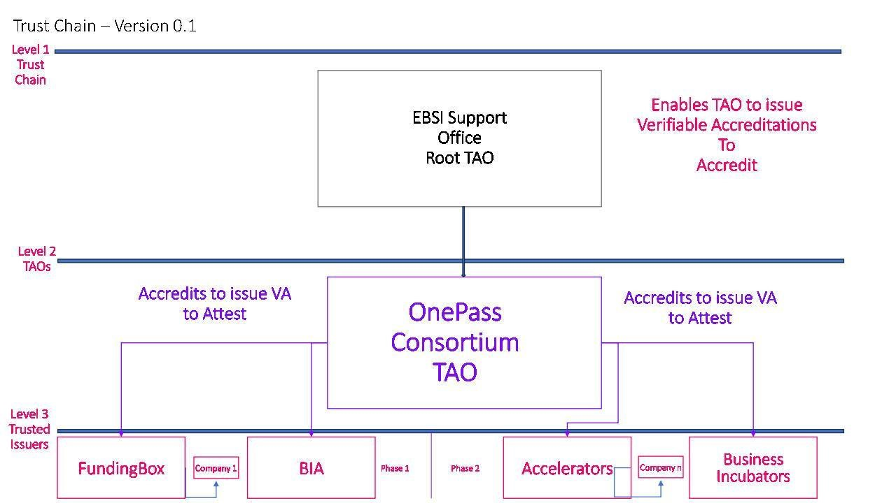

# Criteria to become a TAO and Issuer of credentials

## Trust Model Roles and their Permissions

In order to provide some background, the following is a summary of the trust model as defined by EBSI.
The Root TAO is the owner of the chain and is responsible for the governance of the entire trust chain.
Root TAOs may accredit TAOs to govern a segment of the chain. TAOs may accredit Trusted Issuers to issue
domain-specific Verifiable Credentials. The Verifiable Trust Model defines accreditations that the holder
must follow. Accreditation holders (legal entities) can have multiple accreditations from a single or
numerous trust chains, where each accreditation belongs to one trust chain that gives them issuing or
governance capabilities.

A Trust Chain must contain all three roles, even if a single DID would represent all three roles. The roles
must be RTAO, TAO, and TI, where only TI may issue domain-specific Verifiable Credentials.

A TAO governs an accredited segment on behalf of the RTAO. It may:

- accredit itself to issue domain-specific Verifiable Credentials
- accredit any legal entity to govern or issue domain-specific Verifiable Credentials
- revoke accreditation from a legal entity that was accredited by the TAO

A Trusted Issuer represents the Issuer in a trust chain. It may issue domain-specific Verifiable Credential
types defined by the received accreditation.

## TAO and TI roles within the pilot use case

In the context of the OnePass Pilot use case, the Root TAO will be EBSI. In the first phase of the project, the
TAO will be the OnePass consortium and the TIs of the first phase of legal existence credentials will be
FundingBox and BIA. The reason why these partners have been selected as the TIs for the first phase is
because they are experienced in doing legal checks of entities. FundingBox has performed thousands of
legal checks of beneficiaries from countries across European and BIA specialises in the requirements from
Bulgaria.

The criteria to become a TAO or a TI in the second phase of the pilot use case will be determined following
the initial learnings of the first phase and the credentials to be issued in the second phase.
