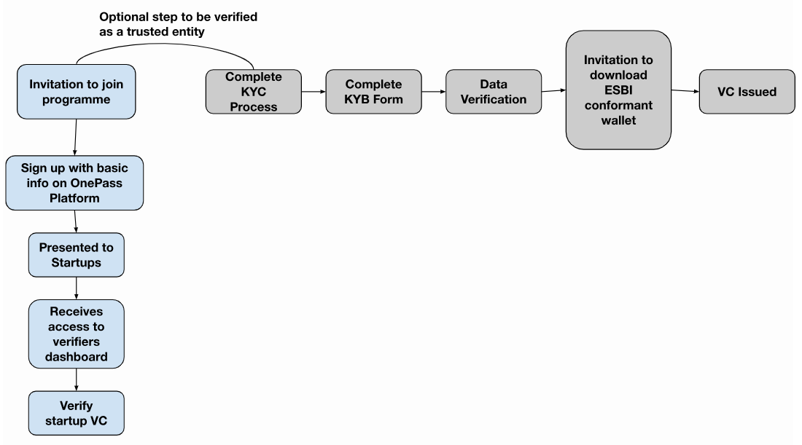

# Onboarding Process for Holders, Issuers, and Verifiers

## Onboarding Process for Holders

_Invitation to the programme_: In the first phase of the pilot use case, the holders will be early stage startups.
They will be invited to the programme through the project website and complementary channels to be
created as part of the outreach strategy defined in D4.4 Adopters Outreach Strategy, where they can register their interest to join by completing some basic admissibility company information. This will be
reviewed by FundingBox.

_Complete KYC Process_: If they are deemed eligible for the programme during the initial eligibility check,
they will be invited to complete the KYC process to confirm the identity of the company founders and legal
representatives.

_Complete KYB Form_: On completion of the KYC process, they will be invited to complete the basic questions
on the legal existence of the company via the OnePass platform. The information will be collected via an
application form.

_Data Verification_: The data related to the legal existence will be checked by either FundingBox or BIA
depending on the location of the company.
Invitation to download EBSI conformant Wallet: On verification of the data, the holder will be invited to
download an EBSI conformant wallet of their choice (if they don’t already have one).
Issuance of VC: On validation of their date, they will be issued the verifiable credential to store in their
wallet.

_Presented to investors_: When the startup receives the VC, they will be presented to potential investors.
The programme will be open for any startups, however, we will be targeting startups going through other
programmes such as the UASEED Ukraine project, BEYOND 2nd cohort of startups and all startups who
would have completed the legal check through other open calls and funding programmes. The details can
be found in the deliverable D4.4 Adopters Outreach strategy.

## Onboarding Process for Issuers

To become a Trusted Issuer, the Legal Entity (LE), must have a valid entry in the DID registry, and it must
be invited into a Trust Chain. An invitation allows the LE to accept the registration by writing the Verifiable
Credential into the smart contract. A Trusted Issuer may participate in multiple Trust Chains with multiple
roles and each participation can be revoked separately from the smart contract.

In phase 1 of the pilot use case, the trusted issuers will be FundingBox and BIA. In phase 2, the issuers of
the legal existence KYB credentials will be extended beyond the project partners to organisations such as
accelerators or business incubator centres.

To become an issuer, approval will be required by 100% of the partners representatives within the TAO
based on criteria to be defined. However, it will be based on the issuer background, expertise, type of
credential to be issued. As new credentials are added, the review and approval process will be updated.

## Onboarding Process for Verifiers

In the pilot use case, the verifiers will be Investors. They will go through a similar onboarding process as
the holders. Once the investors have received the VC, they will be presented with investable startups and
can verify the VC presented by the startup.

_Invitation to join programme_: The verifiers (e.g. investors) can request to join the programme via the
project website and complementary channels to be created as part of the outreach strategy defined in
D4.4 Adopters Outreach Strategy, where they can register their interest to join by completing some basic
admissibility company information via the Onepass Platform. This will be reviewed by FundingBox.

_Presented to startups_: The verifiers (e.g. investors) will be presented with a list of verified startups.
Access to verifiers dashboard and verify startup’s VC: The verifier will receive access to the verifiers
dashboard provided by the OnePass project which will allow them to request the presentation of a VC and
verify them; or the verifier (any) can get a VC by their own means and verify it with a conformant verifier
wallet.

If the verifier would like to appear as a verified entity, they have the option to complete the KYC and KYB
steps to receive a variable credential themselves. They will receive a verification badge next to their profile.
Complete KYC Process: They can request to complete the KYC process to confirm the identity of the
company's legal representatives.

_Complete KYB Form_: On completion of the KYC process, they will be invited to complete the basic questions
on the legal existence of the company via the OnePass platform. The information will be collected via an
application form.

_Data Verification_: The data related to the legal existence will be checked by either FundingBox or BIA
depending on the location of the company.

_Invitation to download the EBSI conformant wallet_: On verification of the data, the verifier will be
invited to download a conformation wallet.
