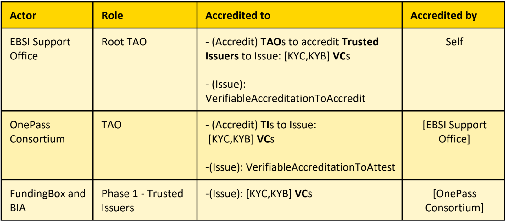
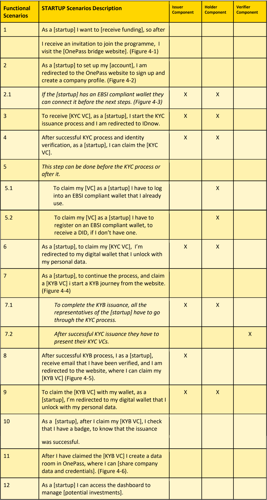
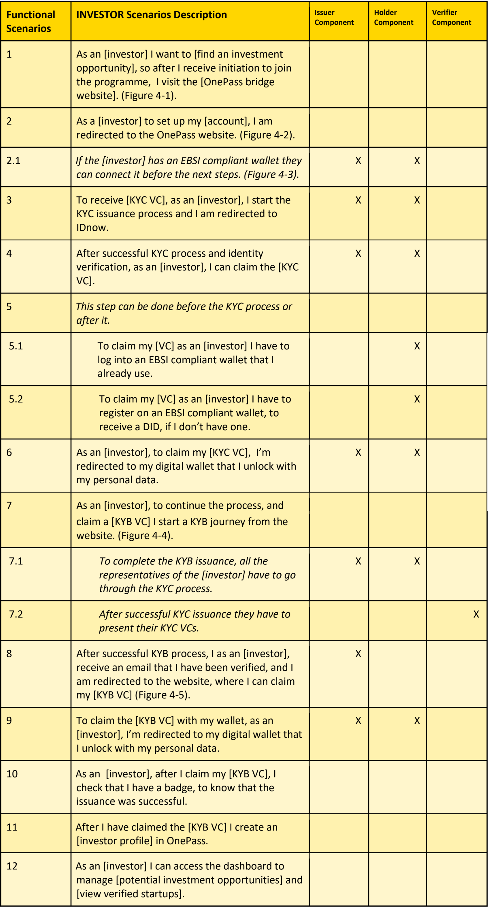
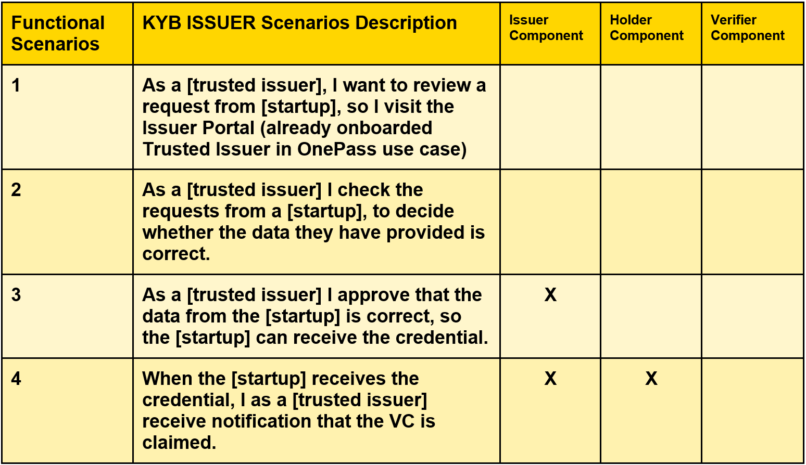

# Capabilities and User Stories

## Capabilities

| TAO Capabilities                 | Issuer Capabilities                                | Holder Wallet Capabilities       | Verifier Capabilities                                             |
| -------------------------------- | -------------------------------------------------- | -------------------------------- | ----------------------------------------------------------------- |
| DID management VA management | DID management VA management VC management | DID management VC management | Request verifiable credentials Verify verifiable credentials. |

## User Stories

The following table lists the actors and their roles for phase 1 of the project.

### Holder User Stories

This scenario describes the steps to claim and present KYC and KYB credentials.

### Investor User Stories

### Trusted Issuer User Stories

