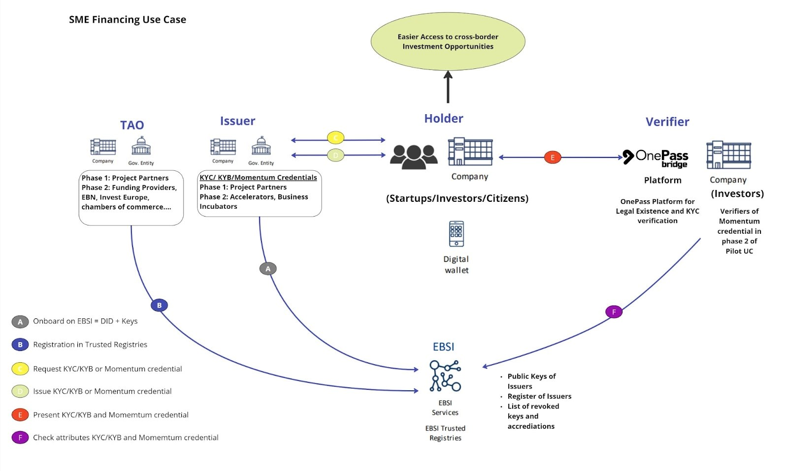

# The OnePass Pilot High level Scope

The following is a high level diagram of the pilot use case detailing the roles of the use case at glance. The
roles are defined in more detail in section 2.2.

## The Pilot UC ObjectivesThe Pilot UC Objectives

- Create a trust framework between Issuers, startups (holders) and investors (verifiers) to foster cross
  border investment within Europe. Issuers being trusted operators of finance and non-finance services
  to startups carrying out attestation of KYC, KYB, and venture readiness i.e. FSTP operators, BICs,
  Accelerators.

- Create a standard for the verification of startup investability in Europe.
- To expand the impact of the Pilot use case beyond the consortium.

## The Pilot UC Roles

_TAOs_: In Verifiable Credentials use cases, a TAO is an organisation that can accredit an issuer with the
ability to issue certain types of Verifiable Credentials. In the first phase of the OnePass use case, the TAO
will be the TAO committee chaired by the project coordinator and with 1 representative of each OnePass
project consortium partner. In the later phases of the project, other existing organisations with accredited
reputation as representatives of target issuer organisations, can be considered based on the learnings from
the first phase and the credentials to be issued. For example, these could be other funding providers
specialised in supporting Startups, or startup associations such as European Startup Network, Invest
Europe IVZW, European BIC Network, the European Business Network, or European Institute of Innovation
and Technology (EIT).

_Trusted Issuers_: The Trusted Issuer is a role that a Legal Entity might perform by creating a Verifiable
Credential, associating it with a specific subject, and transmitting it to a holder. The Issuer is trusted as it is
accredited by a TAO, the accreditation is stored on the ledger and can be verified later. Issuers could include
governments, businesses, non-profit organisations, trade associations. In the first phase of the OnePass
project, the issuers will be the FundingBox and BIA as entities specialised in carrying out KYC, KYB and VRM
type of procedures as part of their business-as-usual activities of public funding distribution. The purpose
of this is to test and showcase the entire process, ensuring compatibility with EBSI. Following the learnings
from phase 1, the trusted framework will be opened to allow other issuers to be able to join the D2.1 Pilot
UC Governance Framework 8 programme. For example, these trusted issuers could be accelerators and
Business Incubator Centers fulfilling the accreditation criteria, established by the TAO, to be registered as
Trusted issuers.

_Holders of Credentials_: The holder of a Verifiable Credential sits at the centre of a triangle of trust,
mediating between issuer and verifier. The issuer and holder trust each other, the holder trusts the verifier,
and the verifier trusts the issuer. Any role in the triangle can be played by a person, an institution, or an
IoT-device. The holder of the Verifiable Credential, issued by the issuer, is most often an individual, but it
can also be an organisation. He is the sole owner of the issued Verifiable Credential, and has full control
over its handling, use and verification. Within the OnePass use case, the holder will be an SME. In the first
phase of the project implementation, we will focus on early stage startups as a holder and in later stages,
we will broaden the range to also include SMEs in more mature stages. In addition an investor will also be
a holder as they will go through the same verification process as the startups.

_Trusted Verifiers_: It is a role an entity performs by receiving one or more Verifiable Credentials, optionally
inside a verifiable presentation, for processing. For example, in the OnePass use case, the Trusted issuer
can be an investor or a public funding donor who will verify the legal existence of an SME based on the
credential shared by the SME (holder). In addition, the verifier will be the OnePass bridge platform which
will verify the credentials presented during the enrollment process.
